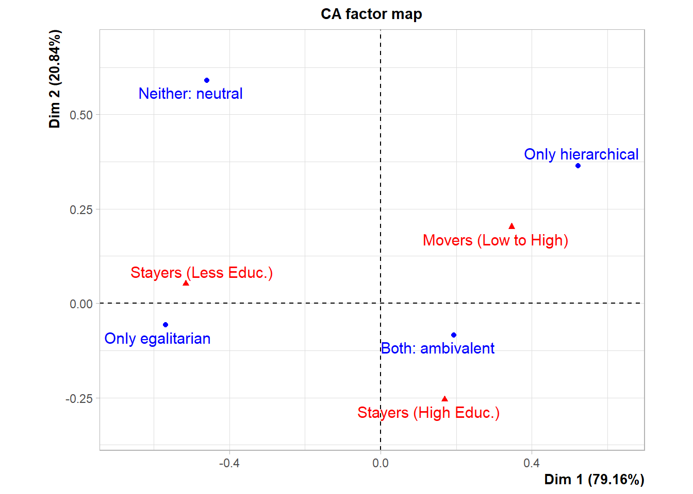
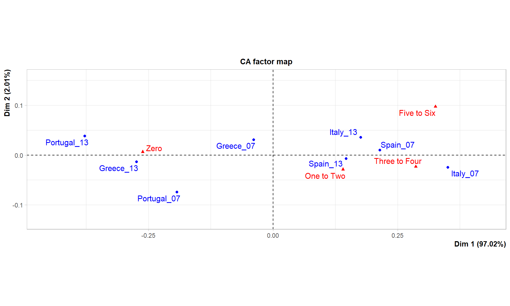

::: {.cell}

:::

::: {.cell}
::: {.cell-output-display}
{width=672}
:::

::: {.cell-output .cell-output-stdout}
```
**Results of the Correspondence Analysis (CA)**
The row variable has  4  categories; the column variable has 3 categories
The chi square of independence between the two variables is equal to 15.66818 (p-value =  0.01565024 ).
*The results are available in the following objects:

   name              description                   
1  "$eig"            "eigenvalues"                 
2  "$col"            "results for the columns"     
3  "$col$coord"      "coord. for the columns"      
4  "$col$cos2"       "cos2 for the columns"        
5  "$col$contrib"    "contributions of the columns"
6  "$row"            "results for the rows"        
7  "$row$coord"      "coord. for the rows"         
8  "$row$cos2"       "cos2 for the rows"           
9  "$row$contrib"    "contributions of the rows"   
10 "$call"           "summary called parameters"   
11 "$call$marge.col" "weights of the columns"      
12 "$call$marge.row" "weights of the rows"         
```
:::
:::

::: {.cell .fig-cap-location-margin}
::: {.cell-output .cell-output-stdout}
```
**Results of the Correspondence Analysis (CA)**
The row variable has  8  categories; the column variable has 4 categories
The chi square of independence between the two variables is equal to 436.1788 (p-value =  2.930305e-79 ).
*The results are available in the following objects:

   name              description                   
1  "$eig"            "eigenvalues"                 
2  "$col"            "results for the columns"     
3  "$col$coord"      "coord. for the columns"      
4  "$col$cos2"       "cos2 for the columns"        
5  "$col$contrib"    "contributions of the columns"
6  "$row"            "results for the rows"        
7  "$row$coord"      "coord. for the rows"         
8  "$row$cos2"       "cos2 for the rows"           
9  "$row$contrib"    "contributions of the rows"   
10 "$call"           "summary called parameters"   
11 "$call$marge.col" "weights of the columns"      
12 "$call$marge.row" "weights of the rows"         
```
:::

::: {.cell-output-display}
{#fig-stack width=960}
:::
:::
