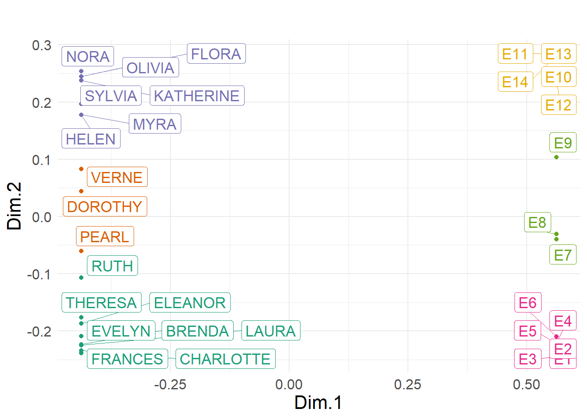

# Setup

::: {.cell}

```{.r .cell-code}
    knitr::opts_chunk$set(include = TRUE, echo = TRUE, warning = FALSE, message = FALSE)
    library(expm)
```

::: {.cell-output .cell-output-stderr}
```
Loading required package: Matrix
```
:::

::: {.cell-output .cell-output-stderr}
```

Attaching package: 'expm'
```
:::

::: {.cell-output .cell-output-stderr}
```
The following object is masked from 'package:Matrix':

    expm
```
:::

```{.r .cell-code}
    library(factoextra)
```

::: {.cell-output .cell-output-stderr}
```
Loading required package: ggplot2
```
:::

::: {.cell-output .cell-output-stderr}
```
Welcome! Want to learn more? See two factoextra-related books at https://goo.gl/ve3WBa
```
:::

```{.r .cell-code}
    library(ggpubr)
    library(here)
```

::: {.cell-output .cell-output-stderr}
```
here() starts at C:/Users/Omar Lizardo/Google Drive/UCLA/mysite
```
:::

```{.r .cell-code}
    library(sjPlot)
```

::: {.cell-output .cell-output-stderr}
```
Learn more about sjPlot with 'browseVignettes("sjPlot")'.
```
:::

```{.r .cell-code}
    library(tidyverse)
```

::: {.cell-output .cell-output-stderr}
```
── Attaching core tidyverse packages ──────────────────────── tidyverse 2.0.0 ──
✔ dplyr     1.1.4     ✔ readr     2.1.5
✔ forcats   1.0.0     ✔ stringr   1.5.1
✔ lubridate 1.9.3     ✔ tibble    3.2.1
✔ purrr     1.0.2     ✔ tidyr     1.3.1
```
:::

::: {.cell-output .cell-output-stderr}
```
── Conflicts ────────────────────────────────────────── tidyverse_conflicts() ──
✖ purrr::%||%()   masks base::%||%()
✖ tidyr::expand() masks Matrix::expand()
✖ dplyr::filter() masks stats::filter()
✖ dplyr::lag()    masks stats::lag()
✖ tidyr::pack()   masks Matrix::pack()
✖ tidyr::unpack() masks Matrix::unpack()
ℹ Use the conflicted package (<http://conflicted.r-lib.org/>) to force all conflicts to become errors
```
:::

```{.r .cell-code}
    source("https://github.com/olizardo/Two-Mode-Relational-Similarity/blob/main/Functions/gen.sim.corr.abs.R?raw=true")
     source("https://github.com/olizardo/Two-Mode-Relational-Similarity/blob/main/Functions/tm.corr.dist.R?raw=true")
```
:::


# Data

::: {.cell}

```{.r .cell-code}
    A <- matrix(
         c(
          1, 1, 1, 1, 1,  1, 0, 1, 1,  0, 0, 0, 0, 0, 
          1, 1, 1, 0, 1,  1, 1, 1, 0,  0, 0, 0, 0, 0, 
          0, 1, 1, 1, 1,  1, 1, 1, 1,  0, 0, 0, 0, 0, 
          1, 0, 1, 1, 1,  1, 1, 1, 0,  0, 0, 0, 0, 0, 
          0, 0, 1, 1, 1,  0, 1, 0, 0,  0, 0, 0, 0, 0, 
          0, 0, 1, 1, 1,  1, 0, 1, 0,  0, 0, 0, 0, 0, 
          0, 0, 0, 1, 1,  1, 1, 1, 0,  0, 0, 0, 0, 0, 
          0, 0, 0, 1, 1,  0, 1, 1, 1,  0, 0, 0, 0, 0, 
          
          0, 0, 0, 0, 0,  0, 1, 1, 1,  0, 0, 1, 0, 0, 
          0, 0, 0, 0, 0,  0, 0, 1, 1,  1, 0, 1, 0, 0, 
          0, 0, 0, 0, 0,  0, 0, 1, 1,  1, 0, 1, 1, 1,
          0, 0, 0, 0, 0,  0, 1, 1, 1,  1, 0, 1, 1, 1,
          0, 0, 0, 0, 0,  0, 1, 0, 1,  1, 1, 1, 1, 1,
          0, 0, 0, 0, 0,  0, 1, 1, 0,  1, 1, 1, 0, 0,
          0, 0, 0, 0, 0,  0, 0, 0, 1,  0, 1, 0, 0, 0,
          0, 0, 0, 0, 0,  0, 0, 0, 1,  0, 1, 0, 0, 0, 
          
          0, 0, 0, 0, 0,  1, 0, 1, 1,  0, 0, 0, 0, 0,
          0, 0, 0, 0, 0,  0, 0, 1, 1,  0, 0, 0, 0, 0),
          ncol = 14, byrow = TRUE)
     w <- c("EVELYN", "LAURA", "THERESA", "BRENDA", "CHARLOTTE", "FRANCES", "ELEANOR", "RUTH", "VERNE", "MYRA", "KATHERINE", "SYLVIA", "NORA", "HELEN", "OLIVIA", "FLORA", "PEARL", "DOROTHY")
     e <- paste("E", c(1:14), sep = "")
     rownames(A) <- w
     colnames(A) <- e
```
:::

::: {.cell}

```{.r .cell-code}
     P <- matrix(0, nrow(A), nrow(A))
     rownames(P) <- w
     colnames(P) <- w
     G <- matrix(0, ncol(A), ncol(A))
     rownames(G) <- e
     colnames(G) <- e
     At <- t(A)
     s1 <- cbind(P, A)
     s2 <- cbind(At, G)
     B <- rbind(s1, s2)
     B2 <- B%*%B
```
:::


::: {.cell}

```{.r .cell-code}
     sim.res <- gen.sim.corr.abs(B)
     mds.res <- get.mds(sim.res$col.sims) 
     mds.res[, 2] <- mds.res[, 2] * 10000
     clus.res <- get.clus(mds.res, k = 6)
     p <- get.plot(clus.res)
     p
```

::: {.cell-output-display}
{width=672}
:::

```{.r .cell-code}
    save_plot("C:/Users/Omar Lizardo/OneDrive/Desktop/grs-bipart.png", width = 30, height = 25)
```

::: {.cell-output .cell-output-stdout}
```
png 
  2 
```
:::
:::
