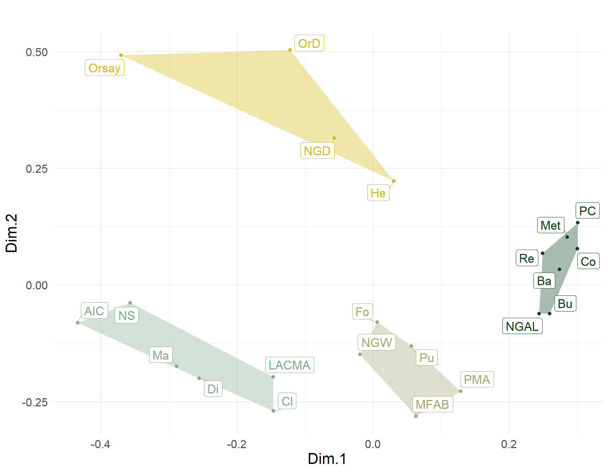
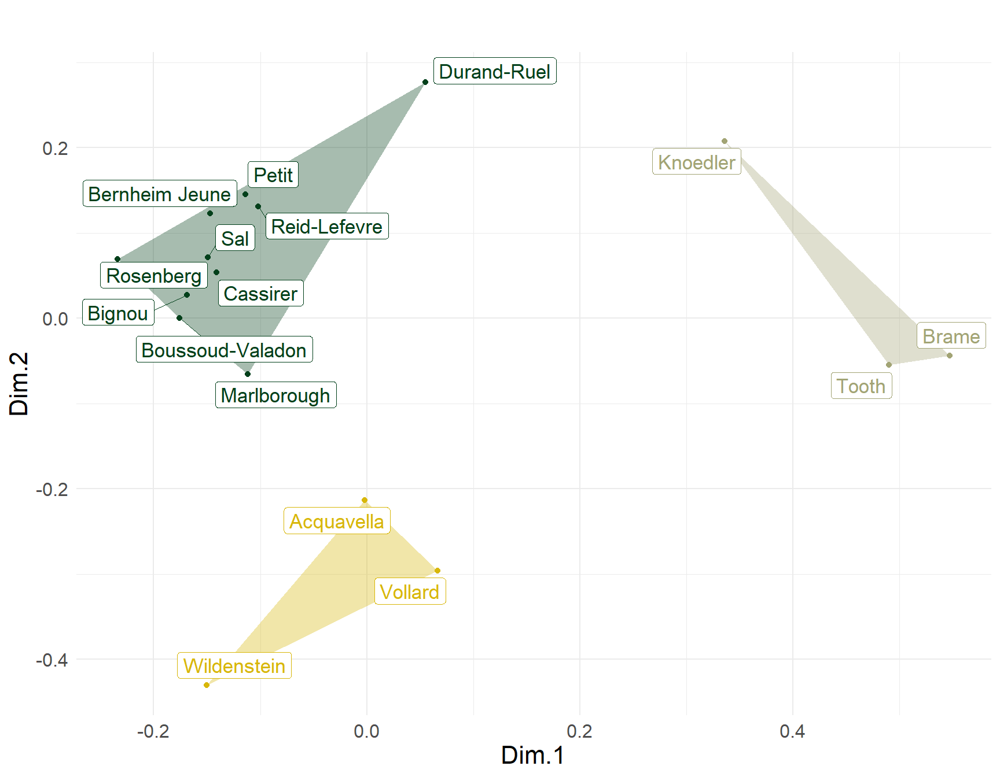
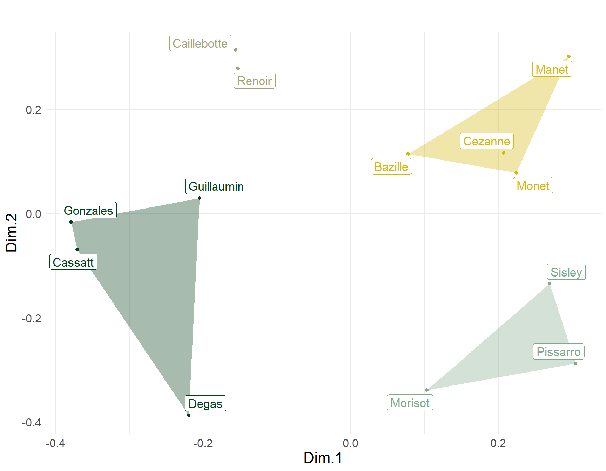
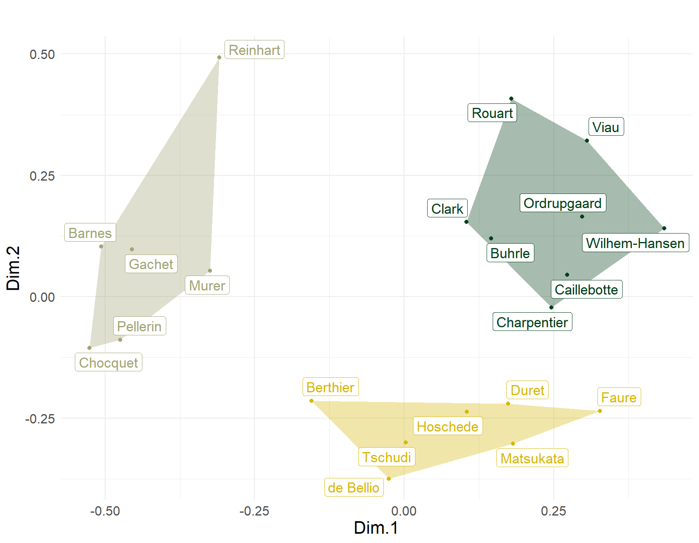

Cutting (2006) collected data on impressionist artists from a variety of sources. Three tables are relevant for the following analysis. One compiles a list of impressionist painters by the number of paintings housed in each of twenty two museums known for their impressionist collections. The first seven are "major" museums (e.g., the Met, Art Institute of Chicago, National Gallery in London, and the rest are more regional and specialized). The second lists the first major dealers of impressionist arts in the rows and the number of paintings they should for each artist in the columns. Finally, the third table lists the first major collectors of impressionist art in the rows, by the number of paintings of each artist they collected (in the columns). The data can be found [here](https://docs.google.com/spreadsheets/d/1CBy0LMC1KhSPw_cTPNtgKshnniQT4gaPP8eD-0zwGfU/edit?usp=sharing). You will need the function `tm.corr.dist` which you can find [here](https://github.com/olizardo/Two-Mode-Relational-Similarity).

On the first sheet, is the artist by museum data. On the second sheet is the dealer by artist data. On the third sheet is the collector by artist data. In all three two-way tables the cell in each entry $x_{ij}$ is a count. In the first case, the number of paintings from artist *i* held by the $j^{th}$ museum. In the second case, the number of paintings that dealer *i* sold from the $j^{th}$ artist. In the third case, the number of paintings from artist *j* collected by collector *i*. 

These are data that are ideal to analyze from the perspective of generalized relational similarity (Kovacs, 2010). Cutting (2006) analyzed the data using multidimensional scaling of the similarities but these were computed using the standard correlation distance. The correlation distance treats pairs of actors as similar if they have similar patterns of object choice. In a generalized relational similarity approach, on the other hand, actors are similar if they have similar patterns of choice with respect to *similar* objects. This is different from the usual similarity approach used by Cutting (2006) in which actors are similar only if they have similar patterns of choice, but where the similarity of the objects chosen is not taken into account. 

I analyze these data using the two-mode variant of generalized similarity discussed in [Lizardo (2024)](https://www.sciencedirect.com/science/article/pii/S0378873323000461), where the correlation distance is tuned using the similarity in the other mode computed from the one-mode projection using the Breiger (1974) approach. In the museum table, we can think of the museums as the (institutional) "actors" doing the choosing and the impressionist artists as the objects chosen. In the same way, in dealers table, we can think of the dealers as the actors doing the choosing and the impressionist painters (or rather their paintings) as the objects chosen. Finally, in the collectors table, the collectors are the actors and the paintings collected from each artist the objects. 

::: {.cell}
::: {.cell-output-display}
{#fig-mus-sim width=864}
:::
:::

Accordingly, artists are similar to the extent that they are chosen by museums with similar patterns of cultural choice. Museums are similar to the extent that they choose similar artists. In the same way, dealers are similar to the extent that they choose similar artists, whereby artists' similarity is defined by their distribution across dealers (artists chosen by similar dealers are similar). Collectors' generalized similarities are defined in the same way as the dealers'. Thus, we should expect to see a partitioning of the three sets of actors that reveals something about the wider field they are embedded in.  You can also get all the code needed to reproduce the plots shown below by clicking the "view source" link in the outline menu on the right. 

@fig-mus-sim shows the non-metric multidimensional scaling plot of generalized similarities across museums, clustered into four groups.  Each cluster contains one or two of Cutting's seven "major" museums surrounded by minor satellites, revealing differentiation by region and status. Thus, the upper left is the Orsay cluster--considered the world's leading impressionist museum--surrounded by three European satellites: Two Danish museums (OrD and NGD) and a Museum in St. Petersburg. The middle right cluster contains two of the world's leading museums, located in the two cities at the center of the global artworld: The Met in New York City and the National Gallery of Art in London (NGAL). Here, status serves as a glue linking the choices of these two institutions across the Atlantic. These are surrounded by museums in Washington DC (PC), Switzerland (RE and Bu), Pennsylvania (Ba), and a smaller London museums (Co). Continuing clockwise, we find a cluster anchored by the Philadelphia Museum of Art (PMA) and Museum of Fine Arts in Boston (MFAB), surrounded by a Harvard Art Museum (Fo)---in keeping with the regional logic---along with a state museum in Moscow (Pu). Finally, the last cluster is centered on two major "second city" (e.g., relative to New York) museum in the U.S.: The Art Institute of Chicago (AIC) and the Los Angeles County Museum of Art. These are surrounded by museums in Pasadena (NS)---again in keeping with the regional logic---along with institutions in Tennessee (Di), and Massachusetts (Cl). Surprisingly, this cluster also features a smaller Parisian museum (Ma).

::: {.cell}
::: {.cell-output-display}
{#fig-deal-sim width=864}
:::
:::

What about the dealers? The two-mode generalized similarities for these actors are shown in @fig-deal-sim. The biggest cluster in the upper-left contains four out of the six "major" dealers according to Cutting (2006, pp. 93-95): Durand-Ruel, Petit, Bernheim-June and Rosenberg. These are all except Vollard and Wildenstein who form their own cluster in the lower-left (joined by New-York-based Acquavella), likely united by their voraciousness for Cezanne. The MDS maps of dealers differs systematically from that presented by Cutting (Fig. 6.1, p. 96) based on the simple correlation distance. 

::: {.cell}
::: {.cell-output-display}
{#fig-art-sim width=864}
:::
:::

The map of artists based on dealers tastes shown in @fig-art-sim, also differs from that presented by Cutting (*ibid*). In Cutting's plot, Guillaumin, Manet, Monet, Pissarro and Sisley appear packed in the same area of the space, suggesting maximum similarity among these five artists. Taking into account the generalized similarity among dealers who sold their work, we can see that Manet and Monet are most similar, Sisley and Pissarro form their own cluster, and Guillaumin is clearly distinct from these two groups. In Cutting's plot, Degas and Renoir are similar, but taking into account similarity across dealers show that they are quite distinct along the second dimension, and that Renoir is most similar to Caillebotte, while Degas is most similar to Guillaumin, Gonzales, and Cassatt. 

::: {.cell}
::: {.cell-output-display}
{#fig-coll-sim width=864}
:::
:::

What about the collectors? The relevant two-mode similarity MDS plot is shown in @fig-coll-sim. The plot divides clearly into three clusters. The lower-right hand group includes Faure, Hoschede, Duret, and de Bellio, all four listed by Cutting (2006, p. 98) as the earliest impressionist collectors (early 1870s). They are joined by Tschudi a pioneer collector from Germany and Matsukata another early collector from Japan. The two mode generalized similarities therefore are picking up commonalities in their collecting patterns based on *timing* (as pioneers of impressionist collecting). The rest of the "first generation" collectors are split into two distinct clusters in the upper portion of the plot. Charpentier, Rouart, and Caillebotte on the right, and Choquet and Gachet on the left. Interesting, the two major early American collectors of this era Clark and Barnes are split across these two different groups, suggesting systematic differences in their patterns of cultural choice.

# References
Breiger, R. L. (1974). The duality of persons and groups. *Social Forces*, 53(2), 181-190.

Cutting, J. E. (2006). *Impressionism and Its Canon*. University Press of America.

Kovács, B. (2010). A generalized model of relational similarity. *Social Networks*, 32(3), 197–211.

Lizardo, O. (2024). Two-mode relational similarities. *Social Networks*, 76, 34–41.