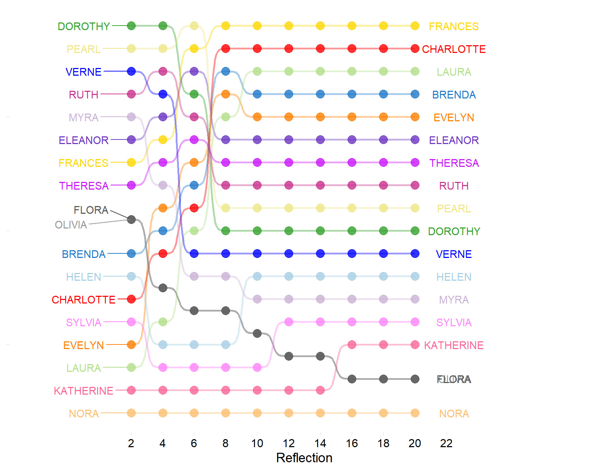
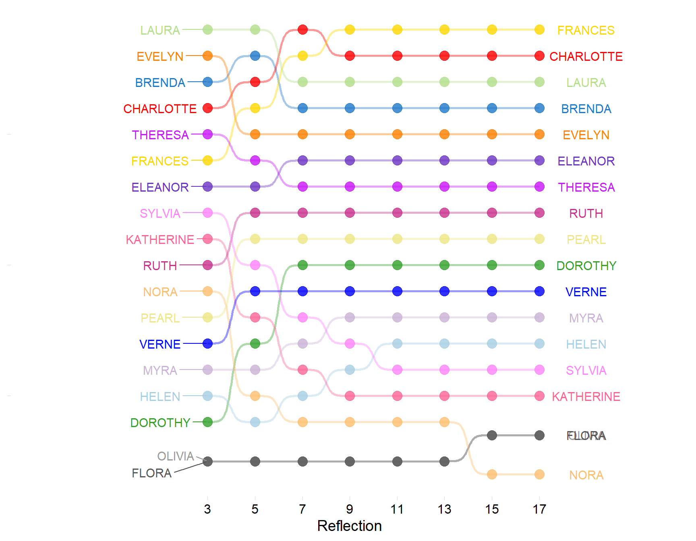
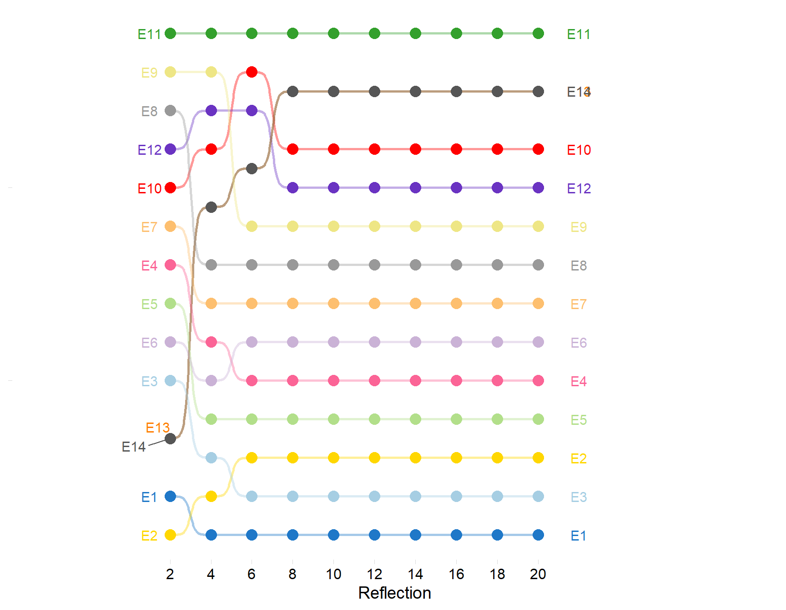
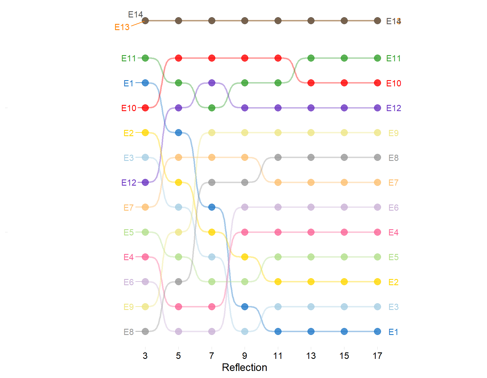

## Introduction 
In a [2018 piece published in *Poetics*](https://doi.org/10.1016/j.poetic.2018.04.003) I adapted an approach to computing "reflective centralities" in two-mode data developed by [Hidalgo & Hausmann (2009)](https://www.pnas.org/doi/abs/10.1073/pnas.0900943106)---hereafter HH---to generalize basic formal notions in the study of cultural taste. Namely, "omnivorousness" on the side of people and "popularity" on the side of genres. The basic idea is that people can be characterized by the formal properties of the genres they choose (e.g., popularity versus nicheness) and genres can be characterized by the formal properties of the people who choose them (e.g., omnivores versus univores), at various levels of "reflections" (see the paper for more details).

Of course, the HH reflective approach is not restricted to any type of data---although I would argue there is a particular elective affinity between this formalization and the substantive subject of cultural taste. In fact, it can be considered part of a family of reflective methods to compute the centralities of object in one node set in two-mode networks using relational information from the objects in the other node set.


::: {#tbl-southern .cell tbl-cap='Southern Women Data.' tbl-colwidths='2'}
::: {.cell-output-display}
`````{=html}
<table style="NAborder-bottom: 0;">
 <thead>
  <tr>
   <th style="text-align:left;">   </th>
   <th style="text-align:center;"> E1 </th>
   <th style="text-align:center;"> E2 </th>
   <th style="text-align:center;"> E3 </th>
   <th style="text-align:center;"> E4 </th>
   <th style="text-align:center;"> E5 </th>
   <th style="text-align:center;"> E6 </th>
   <th style="text-align:center;"> E7 </th>
   <th style="text-align:center;"> E8 </th>
   <th style="text-align:center;"> E9 </th>
   <th style="text-align:center;"> E10 </th>
   <th style="text-align:center;"> E11 </th>
   <th style="text-align:center;"> E12 </th>
   <th style="text-align:center;"> E13 </th>
   <th style="text-align:center;"> E14 </th>
  </tr>
 </thead>
<tbody>
  <tr>
   <td style="text-align:left;"> EVELYN </td>
   <td style="text-align:center;"> 1 </td>
   <td style="text-align:center;"> 1 </td>
   <td style="text-align:center;"> 1 </td>
   <td style="text-align:center;"> 1 </td>
   <td style="text-align:center;"> 1 </td>
   <td style="text-align:center;"> 1 </td>
   <td style="text-align:center;"> 0 </td>
   <td style="text-align:center;"> 1 </td>
   <td style="text-align:center;"> 1 </td>
   <td style="text-align:center;"> 0 </td>
   <td style="text-align:center;"> 0 </td>
   <td style="text-align:center;"> 0 </td>
   <td style="text-align:center;"> 0 </td>
   <td style="text-align:center;"> 0 </td>
  </tr>
  <tr>
   <td style="text-align:left;"> LAURA </td>
   <td style="text-align:center;"> 1 </td>
   <td style="text-align:center;"> 1 </td>
   <td style="text-align:center;"> 1 </td>
   <td style="text-align:center;"> 0 </td>
   <td style="text-align:center;"> 1 </td>
   <td style="text-align:center;"> 1 </td>
   <td style="text-align:center;"> 1 </td>
   <td style="text-align:center;"> 1 </td>
   <td style="text-align:center;"> 0 </td>
   <td style="text-align:center;"> 0 </td>
   <td style="text-align:center;"> 0 </td>
   <td style="text-align:center;"> 0 </td>
   <td style="text-align:center;"> 0 </td>
   <td style="text-align:center;"> 0 </td>
  </tr>
  <tr>
   <td style="text-align:left;"> THERESA </td>
   <td style="text-align:center;"> 0 </td>
   <td style="text-align:center;"> 1 </td>
   <td style="text-align:center;"> 1 </td>
   <td style="text-align:center;"> 1 </td>
   <td style="text-align:center;"> 1 </td>
   <td style="text-align:center;"> 1 </td>
   <td style="text-align:center;"> 1 </td>
   <td style="text-align:center;"> 1 </td>
   <td style="text-align:center;"> 1 </td>
   <td style="text-align:center;"> 0 </td>
   <td style="text-align:center;"> 0 </td>
   <td style="text-align:center;"> 0 </td>
   <td style="text-align:center;"> 0 </td>
   <td style="text-align:center;"> 0 </td>
  </tr>
  <tr>
   <td style="text-align:left;"> BRENDA </td>
   <td style="text-align:center;"> 1 </td>
   <td style="text-align:center;"> 0 </td>
   <td style="text-align:center;"> 1 </td>
   <td style="text-align:center;"> 1 </td>
   <td style="text-align:center;"> 1 </td>
   <td style="text-align:center;"> 1 </td>
   <td style="text-align:center;"> 1 </td>
   <td style="text-align:center;"> 1 </td>
   <td style="text-align:center;"> 0 </td>
   <td style="text-align:center;"> 0 </td>
   <td style="text-align:center;"> 0 </td>
   <td style="text-align:center;"> 0 </td>
   <td style="text-align:center;"> 0 </td>
   <td style="text-align:center;"> 0 </td>
  </tr>
  <tr>
   <td style="text-align:left;"> CHARLOTTE </td>
   <td style="text-align:center;"> 0 </td>
   <td style="text-align:center;"> 0 </td>
   <td style="text-align:center;"> 1 </td>
   <td style="text-align:center;"> 1 </td>
   <td style="text-align:center;"> 1 </td>
   <td style="text-align:center;"> 0 </td>
   <td style="text-align:center;"> 1 </td>
   <td style="text-align:center;"> 0 </td>
   <td style="text-align:center;"> 0 </td>
   <td style="text-align:center;"> 0 </td>
   <td style="text-align:center;"> 0 </td>
   <td style="text-align:center;"> 0 </td>
   <td style="text-align:center;"> 0 </td>
   <td style="text-align:center;"> 0 </td>
  </tr>
  <tr>
   <td style="text-align:left;"> FRANCES </td>
   <td style="text-align:center;"> 0 </td>
   <td style="text-align:center;"> 0 </td>
   <td style="text-align:center;"> 1 </td>
   <td style="text-align:center;"> 1 </td>
   <td style="text-align:center;"> 1 </td>
   <td style="text-align:center;"> 1 </td>
   <td style="text-align:center;"> 0 </td>
   <td style="text-align:center;"> 1 </td>
   <td style="text-align:center;"> 0 </td>
   <td style="text-align:center;"> 0 </td>
   <td style="text-align:center;"> 0 </td>
   <td style="text-align:center;"> 0 </td>
   <td style="text-align:center;"> 0 </td>
   <td style="text-align:center;"> 0 </td>
  </tr>
  <tr>
   <td style="text-align:left;"> ELEANOR </td>
   <td style="text-align:center;"> 0 </td>
   <td style="text-align:center;"> 0 </td>
   <td style="text-align:center;"> 0 </td>
   <td style="text-align:center;"> 1 </td>
   <td style="text-align:center;"> 1 </td>
   <td style="text-align:center;"> 1 </td>
   <td style="text-align:center;"> 1 </td>
   <td style="text-align:center;"> 1 </td>
   <td style="text-align:center;"> 0 </td>
   <td style="text-align:center;"> 0 </td>
   <td style="text-align:center;"> 0 </td>
   <td style="text-align:center;"> 0 </td>
   <td style="text-align:center;"> 0 </td>
   <td style="text-align:center;"> 0 </td>
  </tr>
  <tr>
   <td style="text-align:left;"> RUTH </td>
   <td style="text-align:center;"> 0 </td>
   <td style="text-align:center;"> 0 </td>
   <td style="text-align:center;"> 0 </td>
   <td style="text-align:center;"> 1 </td>
   <td style="text-align:center;"> 1 </td>
   <td style="text-align:center;"> 0 </td>
   <td style="text-align:center;"> 1 </td>
   <td style="text-align:center;"> 1 </td>
   <td style="text-align:center;"> 1 </td>
   <td style="text-align:center;"> 0 </td>
   <td style="text-align:center;"> 0 </td>
   <td style="text-align:center;"> 0 </td>
   <td style="text-align:center;"> 0 </td>
   <td style="text-align:center;"> 0 </td>
  </tr>
  <tr>
   <td style="text-align:left;"> VERNE </td>
   <td style="text-align:center;"> 0 </td>
   <td style="text-align:center;"> 0 </td>
   <td style="text-align:center;"> 0 </td>
   <td style="text-align:center;"> 0 </td>
   <td style="text-align:center;"> 0 </td>
   <td style="text-align:center;"> 0 </td>
   <td style="text-align:center;"> 1 </td>
   <td style="text-align:center;"> 1 </td>
   <td style="text-align:center;"> 1 </td>
   <td style="text-align:center;"> 0 </td>
   <td style="text-align:center;"> 0 </td>
   <td style="text-align:center;"> 1 </td>
   <td style="text-align:center;"> 0 </td>
   <td style="text-align:center;"> 0 </td>
  </tr>
  <tr>
   <td style="text-align:left;"> MYRA </td>
   <td style="text-align:center;"> 0 </td>
   <td style="text-align:center;"> 0 </td>
   <td style="text-align:center;"> 0 </td>
   <td style="text-align:center;"> 0 </td>
   <td style="text-align:center;"> 0 </td>
   <td style="text-align:center;"> 0 </td>
   <td style="text-align:center;"> 0 </td>
   <td style="text-align:center;"> 1 </td>
   <td style="text-align:center;"> 1 </td>
   <td style="text-align:center;"> 1 </td>
   <td style="text-align:center;"> 0 </td>
   <td style="text-align:center;"> 1 </td>
   <td style="text-align:center;"> 0 </td>
   <td style="text-align:center;"> 0 </td>
  </tr>
  <tr>
   <td style="text-align:left;"> KATHERINE </td>
   <td style="text-align:center;"> 0 </td>
   <td style="text-align:center;"> 0 </td>
   <td style="text-align:center;"> 0 </td>
   <td style="text-align:center;"> 0 </td>
   <td style="text-align:center;"> 0 </td>
   <td style="text-align:center;"> 0 </td>
   <td style="text-align:center;"> 0 </td>
   <td style="text-align:center;"> 1 </td>
   <td style="text-align:center;"> 1 </td>
   <td style="text-align:center;"> 1 </td>
   <td style="text-align:center;"> 0 </td>
   <td style="text-align:center;"> 1 </td>
   <td style="text-align:center;"> 1 </td>
   <td style="text-align:center;"> 1 </td>
  </tr>
  <tr>
   <td style="text-align:left;"> SYLVIA </td>
   <td style="text-align:center;"> 0 </td>
   <td style="text-align:center;"> 0 </td>
   <td style="text-align:center;"> 0 </td>
   <td style="text-align:center;"> 0 </td>
   <td style="text-align:center;"> 0 </td>
   <td style="text-align:center;"> 0 </td>
   <td style="text-align:center;"> 1 </td>
   <td style="text-align:center;"> 1 </td>
   <td style="text-align:center;"> 1 </td>
   <td style="text-align:center;"> 1 </td>
   <td style="text-align:center;"> 0 </td>
   <td style="text-align:center;"> 1 </td>
   <td style="text-align:center;"> 1 </td>
   <td style="text-align:center;"> 1 </td>
  </tr>
  <tr>
   <td style="text-align:left;"> NORA </td>
   <td style="text-align:center;"> 0 </td>
   <td style="text-align:center;"> 0 </td>
   <td style="text-align:center;"> 0 </td>
   <td style="text-align:center;"> 0 </td>
   <td style="text-align:center;"> 0 </td>
   <td style="text-align:center;"> 0 </td>
   <td style="text-align:center;"> 1 </td>
   <td style="text-align:center;"> 0 </td>
   <td style="text-align:center;"> 1 </td>
   <td style="text-align:center;"> 1 </td>
   <td style="text-align:center;"> 1 </td>
   <td style="text-align:center;"> 1 </td>
   <td style="text-align:center;"> 1 </td>
   <td style="text-align:center;"> 1 </td>
  </tr>
  <tr>
   <td style="text-align:left;"> HELEN </td>
   <td style="text-align:center;"> 0 </td>
   <td style="text-align:center;"> 0 </td>
   <td style="text-align:center;"> 0 </td>
   <td style="text-align:center;"> 0 </td>
   <td style="text-align:center;"> 0 </td>
   <td style="text-align:center;"> 0 </td>
   <td style="text-align:center;"> 1 </td>
   <td style="text-align:center;"> 1 </td>
   <td style="text-align:center;"> 0 </td>
   <td style="text-align:center;"> 1 </td>
   <td style="text-align:center;"> 1 </td>
   <td style="text-align:center;"> 1 </td>
   <td style="text-align:center;"> 0 </td>
   <td style="text-align:center;"> 0 </td>
  </tr>
  <tr>
   <td style="text-align:left;"> OLIVIA </td>
   <td style="text-align:center;"> 0 </td>
   <td style="text-align:center;"> 0 </td>
   <td style="text-align:center;"> 0 </td>
   <td style="text-align:center;"> 0 </td>
   <td style="text-align:center;"> 0 </td>
   <td style="text-align:center;"> 0 </td>
   <td style="text-align:center;"> 0 </td>
   <td style="text-align:center;"> 0 </td>
   <td style="text-align:center;"> 1 </td>
   <td style="text-align:center;"> 0 </td>
   <td style="text-align:center;"> 1 </td>
   <td style="text-align:center;"> 0 </td>
   <td style="text-align:center;"> 0 </td>
   <td style="text-align:center;"> 0 </td>
  </tr>
  <tr>
   <td style="text-align:left;"> FLORA </td>
   <td style="text-align:center;"> 0 </td>
   <td style="text-align:center;"> 0 </td>
   <td style="text-align:center;"> 0 </td>
   <td style="text-align:center;"> 0 </td>
   <td style="text-align:center;"> 0 </td>
   <td style="text-align:center;"> 0 </td>
   <td style="text-align:center;"> 0 </td>
   <td style="text-align:center;"> 0 </td>
   <td style="text-align:center;"> 1 </td>
   <td style="text-align:center;"> 0 </td>
   <td style="text-align:center;"> 1 </td>
   <td style="text-align:center;"> 0 </td>
   <td style="text-align:center;"> 0 </td>
   <td style="text-align:center;"> 0 </td>
  </tr>
  <tr>
   <td style="text-align:left;"> PEARL </td>
   <td style="text-align:center;"> 0 </td>
   <td style="text-align:center;"> 0 </td>
   <td style="text-align:center;"> 0 </td>
   <td style="text-align:center;"> 0 </td>
   <td style="text-align:center;"> 0 </td>
   <td style="text-align:center;"> 1 </td>
   <td style="text-align:center;"> 0 </td>
   <td style="text-align:center;"> 1 </td>
   <td style="text-align:center;"> 1 </td>
   <td style="text-align:center;"> 0 </td>
   <td style="text-align:center;"> 0 </td>
   <td style="text-align:center;"> 0 </td>
   <td style="text-align:center;"> 0 </td>
   <td style="text-align:center;"> 0 </td>
  </tr>
  <tr>
   <td style="text-align:left;"> DOROTHY </td>
   <td style="text-align:center;"> 0 </td>
   <td style="text-align:center;"> 0 </td>
   <td style="text-align:center;"> 0 </td>
   <td style="text-align:center;"> 0 </td>
   <td style="text-align:center;"> 0 </td>
   <td style="text-align:center;"> 0 </td>
   <td style="text-align:center;"> 0 </td>
   <td style="text-align:center;"> 1 </td>
   <td style="text-align:center;"> 1 </td>
   <td style="text-align:center;"> 0 </td>
   <td style="text-align:center;"> 0 </td>
   <td style="text-align:center;"> 0 </td>
   <td style="text-align:center;"> 0 </td>
   <td style="text-align:center;"> 0 </td>
  </tr>
</tbody>
<tfoot>
<tr><td style="padding: 0; " colspan="100%"><span style="font-style: italic;">Note: </span></td></tr>
<tr><td style="padding: 0; " colspan="100%">
<sup></sup> Rows ordered according to the generalized blockmodeling solution of Doreian et al. (2004, Table 4).</td></tr>
</tfoot>
</table>

`````
:::
:::


## Reflective Centralities of Persons and Groups
Take the classic case of the duality of persons and groups (Breiger, 1974). At the first level, the most basic measure of centrality is **degree centrality**. 
Recall that a two-mode network composed of a set of people $P$ and their affiliation relations to a set of groups $P$ can be represented by an affiliation matrix $\mathbf{A}$ of dimensions $|P| \times |G|$ with people along the rows and groups across the columns, where $|P|$ is the cardinality of the people set and $|G|$ is the cardinality of the group set, with cell entries $a_{pg}= 1$ if person *p* is affiliated with group *g* and $a_{pg}= 0$ otherwise. 

In this case, the degree centrality of people is given by:

$$
   C^R_p(1) = \sum_g a_{pg}
$$ {#eq-pr1}

And for groups:

$$
   C^R_g(1) = \sum_p a_{pg}
$$ {#eq-gr1}

For instance, for the classic Davis et al. (1941) Southern Women Data shown in @tbl-southern, the centrality of the degree centralities of the people are:


::: {.cell}
::: {.cell-output-display}
| EVELYN | LAURA | THERESA | BRENDA | CHARLOTTE | FRANCES | ELEANOR | RUTH | VERNE | MYRA | KATHERINE | SYLVIA | NORA | HELEN | OLIVIA | FLORA | PEARL | DOROTHY |
|:------:|:-----:|:-------:|:------:|:---------:|:-------:|:-------:|:----:|:-----:|:----:|:---------:|:------:|:----:|:-----:|:------:|:-----:|:-----:|:-------:|
|   8    |   7   |    8    |   7    |     4     |    5    |    5    |  5   |   4   |  4   |     6     |   7    |  7   |   5   |   2    |   2   |   3   |    2    |
:::
:::


And for the groups:


::: {.cell}
::: {.cell-output-display}
| E1 | E2 | E3 | E4 | E5 | E6 | E7 | E8 | E9 | E10 | E11 | E12 | E13 | E14 |
|:--:|:--:|:--:|:--:|:--:|:--:|:--:|:--:|:--:|:---:|:---:|:---:|:---:|:---:|
| 3  | 3  | 6  | 7  | 8  | 7  | 10 | 14 | 12 |  5  |  4  |  6  |  3  |  3  |
:::
:::


The key to the reflective approach is the observation that, once we have these first-order quantities, it is possible to compute "second order centralities" for both people and groups using the centralities of the other mode. 

For people, this is:

$$
   C^R_p(2) = \frac{1}{C^R_p(1)}\sum_g a_{pg}C^R_g(1)
$$ {#eq-pr2}

And for groups:

$$
   C^R_g(2) = \frac{1}{C^R_g(1)}\sum_p a_{pg}C^R_p(1)
$$ {#eq-gr2}

@eq-pr2 says "people are more central when the average membership of the groups they belong to is large" (e.g., $a_{pg} = 1$ and $C^R_g(1)$ is a big number). @eq-gr2 says "groups are more central when the average number of memberships of their members is large" (e.g., $a_{pg} = 1$ and $C^R_p(1)$ is a big number).

Of course, we can keep on going and define third-order reflections:

$$
   C^R_p(3) = \frac{1}{C^R_p(1)}\sum_g a_{pg}C^R_g(2)
$$ {#eq-pr3}

$$
   C^R_g(3) = \frac{1}{C^R_g(1)}\sum_p a_{pg}C^R_p(2)
$$ {#eq-gr3}

@eq-pr3 says something like "people are more central when the average of the average number of memberships of the members of the groups they belong to is large" (e.g., $a_{pg} = 1$ and $C^R_g(2)$ is a big number). @eq-gr3 says something like "groups are more central when the average of the average number of members of the groups their members belong to is large" (e.g., $a_{pg} = 1$ and $C^R_p(2)$ is a big number).

Note that for the people, the even-numbered reflection $C^R_p(2)$ assigns centrality based on a formal feature of the *groups* they belong to (in this case, their degree centrality). On the other hand, the odd-numbered reflection $C^R_p(3)$ assigns centrality based on a formal feature of the *members of the groups* they belong to. 

In the same way, for the groups, the even-numbered reflection $C^R_g(2)$ assigns centrality based on a formal feature of the *people* who belong to them (in this case, their degree centrality). On the other hand, the odd-numbered reflection $C^R_g(3)$ assigns centrality based on a formal feature of the *groups their members belong to*.

More generally, we can define a series of reflective quantities for people and groups (whose verbal interpretation becomes more complex as the number of iterations increases):

$$
   C^R_p(q) = \frac{1}{C^R_p(1)}\sum_g a_{pg}C^R_g(q-1) 
$$

$$
   C^R_g(q) = \frac{1}{C^R_g(1)}\sum_p a_{pg}C^R_p(q-1)
$$ {#eq-grq}

For all $q>1$ (Hidalgo & Hausmann, 2009). This results in a series of vectors of reflective centrality scores for both people and groups across iterations $q =\{1, 2, 3, ....Q\}$, which can be arranged into a $P \times Q$ matrix (for people) and $G \times Q$ matrix (for groups).


::: {#tbl-pr-even .cell .tbl-cap-location-margin tbl-cap='Even numbered reflective centralities for people in the Southern Women Data'}
::: {.cell-output .cell-output-stderr}
```
here() starts at C:/Users/Omar Lizardo/Google Drive/UCLA/mysite
```
:::

::: {.cell-output-display}
|          | Cr_2 | Cr_4 | Cr_6 | Cr_8 | Cr_10 | Cr_12 | Cr_14 | Cr_16 | Cr_18 | Cr_20 |
|:---------|:----:|:----:|:----:|:----:|:-----:|:-----:|:-----:|:-----:|:-----:|:-----:|
|EVELYN    | 15.0 | 9.0  | 7.0  | 4.0  |  5.0  |  5.0  |  5.0  |  5.0  |  5.0  |  5.0  |
|LAURA     | 16.0 | 14.0 | 10.0 | 5.0  |  3.0  |  3.0  |  3.0  |  3.0  |  3.0  |  3.0  |
|THERESA   | 8.0  | 7.0  | 6.0  | 7.0  |  7.0  |  7.0  |  7.0  |  7.0  |  7.0  |  7.0  |
|BRENDA    | 11.0 | 10.0 | 8.0  | 3.0  |  4.0  |  4.0  |  4.0  |  4.0  |  4.0  |  4.0  |
|CHARLOTTE | 13.0 | 11.0 | 9.0  | 2.0  |  2.0  |  2.0  |  2.0  |  2.0  |  2.0  |  2.0  |
|FRANCES   | 7.0  | 6.0  | 2.0  | 1.0  |  1.0  |  1.0  |  1.0  |  1.0  |  1.0  |  1.0  |
|ELEANOR   | 6.0  | 5.0  | 3.0  | 6.0  |  6.0  |  6.0  |  6.0  |  6.0  |  6.0  |  6.0  |
|RUTH      | 4.0  | 3.0  | 5.0  | 8.0  |  8.0  |  8.0  |  8.0  |  8.0  |  8.0  |  8.0  |
|VERNE     | 3.0  | 4.0  | 11.0 | 11.0 | 11.0  | 11.0  | 11.0  | 11.0  | 11.0  | 11.0  |
|MYRA      | 5.0  | 8.0  | 12.0 | 12.0 | 13.0  | 13.0  | 13.0  | 13.0  | 13.0  | 13.0  |
|KATHERINE | 17.0 | 17.0 | 17.0 | 17.0 | 17.0  | 17.0  | 17.0  | 15.0  | 15.0  | 15.0  |
|SYLVIA    | 14.0 | 16.0 | 16.0 | 16.0 | 16.0  | 14.0  | 14.0  | 14.0  | 14.0  | 14.0  |
|NORA      | 18.0 | 18.0 | 18.0 | 18.0 | 18.0  | 18.0  | 18.0  | 18.0  | 18.0  | 18.0  |
|HELEN     | 12.0 | 15.0 | 15.0 | 15.0 | 12.0  | 12.0  | 12.0  | 12.0  | 12.0  | 12.0  |
|OLIVIA    | 9.5  | 12.5 | 13.5 | 13.5 | 14.5  | 15.5  | 15.5  | 16.5  | 16.5  | 16.5  |
|FLORA     | 9.5  | 12.5 | 13.5 | 13.5 | 14.5  | 15.5  | 15.5  | 16.5  | 16.5  | 16.5  |
|PEARL     | 2.0  | 2.0  | 1.0  | 9.0  |  9.0  |  9.0  |  9.0  |  9.0  |  9.0  |  9.0  |
|DOROTHY   | 1.0  | 1.0  | 4.0  | 10.0 | 10.0  | 10.0  | 10.0  | 10.0  | 10.0  | 10.0  |
:::
:::


## Results
### Persons
@tbl-pr-even shows the results of the even-numbered reflections for the people in the Southern women data, using an R function called `reflections` that can be found [here](https://github.com/olizardo/person-group-reflections). @tbl-pr-odd shows the corresponding odd-numbered reflections. Each entry in the table is the rank (ordered so that smaller means higher rank) of the standardized centrality score for each reflection. 


::: {#tbl-pr-odd .cell .tbl-cap-location-margin tbl-cap='Odd numbered reflective centralities for people in the Southern Women Data'}
::: {.cell-output-display}
|          | Cr_3 | Cr_5 | Cr_7 | Cr_9 | Cr_11 | Cr_13 | Cr_15 | Cr_17 | Cr_19 |
|:---------|:----:|:----:|:----:|:----:|:-----:|:-----:|:-----:|:-----:|:-----:|
|EVELYN    | 2.0  | 5.0  | 5.0  | 5.0  |  5.0  |  5.0  |  5.0  |  5.0  |  5.0  |
|LAURA     | 1.0  | 1.0  | 3.0  | 3.0  |  3.0  |  3.0  |  3.0  |  3.0  |  3.0  |
|THERESA   | 5.0  | 6.0  | 7.0  | 7.0  |  7.0  |  7.0  |  7.0  |  7.0  |  7.0  |
|BRENDA    | 3.0  | 2.0  | 4.0  | 4.0  |  4.0  |  4.0  |  4.0  |  4.0  |  4.0  |
|CHARLOTTE | 4.0  | 3.0  | 1.0  | 2.0  |  2.0  |  2.0  |  2.0  |  2.0  |  2.0  |
|FRANCES   | 6.0  | 4.0  | 2.0  | 1.0  |  1.0  |  1.0  |  1.0  |  1.0  |  1.0  |
|ELEANOR   | 7.0  | 7.0  | 6.0  | 6.0  |  6.0  |  6.0  |  6.0  |  6.0  |  6.0  |
|RUTH      | 10.0 | 8.0  | 8.0  | 8.0  |  8.0  |  8.0  |  8.0  |  8.0  |  8.0  |
|VERNE     | 13.0 | 11.0 | 11.0 | 11.0 | 11.0  | 11.0  | 11.0  | 11.0  | 11.0  |
|MYRA      | 14.0 | 14.0 | 13.0 | 12.0 | 12.0  | 12.0  | 12.0  | 12.0  | 12.0  |
|KATHERINE | 9.0  | 12.0 | 14.0 | 15.0 | 15.0  | 15.0  | 15.0  | 15.0  | 15.0  |
|SYLVIA    | 8.0  | 10.0 | 12.0 | 13.0 | 14.0  | 14.0  | 14.0  | 14.0  | 14.0  |
|NORA      | 11.0 | 15.0 | 16.0 | 16.0 | 16.0  | 16.0  | 18.0  | 18.0  | 18.0  |
|HELEN     | 15.0 | 16.0 | 15.0 | 14.0 | 13.0  | 13.0  | 13.0  | 13.0  | 13.0  |
|OLIVIA    | 17.5 | 17.5 | 17.5 | 17.5 | 17.5  | 17.5  | 16.5  | 16.5  | 16.5  |
|FLORA     | 17.5 | 17.5 | 17.5 | 17.5 | 17.5  | 17.5  | 16.5  | 16.5  | 16.5  |
|PEARL     | 12.0 | 9.0  | 9.0  | 9.0  |  9.0  |  9.0  |  9.0  |  9.0  |  9.0  |
|DOROTHY   | 16.0 | 13.0 | 10.0 | 10.0 | 10.0  | 10.0  | 10.0  | 10.0  | 10.0  |
:::
:::


The reflective centrality pattern encoded in the tabular data can be more easily apprehended using a *bump chart*. @fig-pr-even and @fig-pr-odd show such charts for the data corresponding to @tbl-pr-even and @tbl-pr-odd respectively.^[The plots were rendered using the package [`ggbump`](https://github.com/davidsjoberg/ggbump). Color palette is "cols25" from the [`pals`](https://kwstat.github.io/pals/index.html) package.] As the tables show, in all cases, the rankings "freeze" after a relatively small number of iterations ($q \approx 18$)
     

::: {.cell}
::: {.cell-output .cell-output-stderr}
```

Attaching package: 'cowplot'
```
:::

::: {.cell-output .cell-output-stderr}
```
The following object is masked from 'package:lubridate':

    stamp
```
:::

::: {.cell-output-display}
{#fig-pr-even width=864}
:::
:::


As @fig-pr-even shows, $NORA$, $FLORA$, $CHARLOTTE$, and $EVELYN$ are the top-ranked actors when it comes to $C^R_p(2)$:  The average number of members of the groups they belong to. However, their fates in this reflective metric diverge at higher reflections, with $NORA$ and $FLORA$ maintaining their top positions but $CHARLOTTE$ and $EVELYN$ tumbling down the ranks, suggesting that the members of the groups they belong to affiliate with smaller groups than the members of the groups $NORA$ and $FLORA$ belong to (and so on for higher reflections). 

Notably, the reflective centrality ranks at the highest reflection ($q = 20$) in @tbl-pr-even, recovers the Doreian et al. (2004) block partition (see @tbl-southern), but this time with Dorothy and Pearl in the middle separating the two largest blocks of women. 


::: {.cell}
::: {.cell-output-display}
{#fig-pr-odd width=864}
:::
:::


### Groups
@fig-gr-even and @fig-gr-odd show the corresponding bump charts for the events. Just like for this actors, the equilibrium reflective centralities recover the ordering of the columns according to Doreian et al. generalized blockmodel with events 1-6 separated from events 10-15 by events 7-9 (see also Kovacs, 2010). 


::: {.cell}
::: {.cell-output-display}
{#fig-gr-even width=864}
:::
:::


@fig-gr-even shows that $E14$ experiences the most dramatic improvement in status as we move to higher reflections. Relatively low ranked when it comes to the average number of memberships of its members, it increases in standing when considering the average of the average number memberships of its members (and so forth). 

The most dramatic change in status is for $E1$ in @fig-gr-odd, which begins as the top event when centrality is measured as the average size of the memberships of its members, but ends up dead last at higher reflections, suggesting that the average size of the events attended by the members of the groups its members belong to are smaller than other events (and so forth). 


::: {.cell}
::: {.cell-output-display}
{#fig-gr-odd width=864}
:::
:::


## Conclusion
The H-H reflective metric can be an insightful tool to analyze  centralities in two-mode data, respecting the principle of duality (Breiger, 1974). In this post, I showed the approach can reveal substantive meaningful patterns in the position of persons and groups in a classic two-mode network data set. 

## References
Breiger, R. L. (1974). The duality of persons and groups. *Social Forces*, 53(2), 181-190.

Davis, A., Gardner, B. B., & Gardner, M. R. (1941). *Deep South A Social Anthropological Study of Caste and Class*. University of Chicago Press.

Doreian, P., Batagelj, V., & Ferligoj, A. (2004). Generalized blockmodeling of two-mode network data. *Social Networks*, 26(1), 29-53.

Hidalgo, C. A., & Hausmann, R. (2009). The building blocks of economic complexity. *Proceedings of the National Academy of Sciences*, 106(26), 10570-10575.

Kovács, B. (2010). A generalized model of relational similarity. *Social Networks*, 32(3), 197-211.

Lizardo, O. (2018). The mutual specification of genres and audiences: Reflective two-mode centralities in person-to-culture data. *Poetics*, 68, 52-71.
